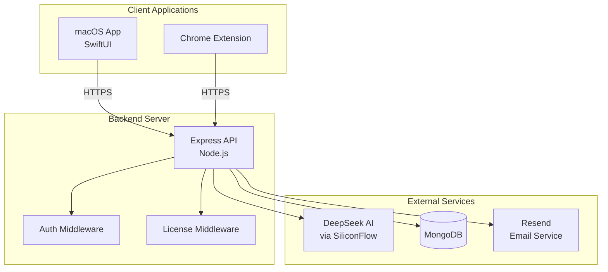
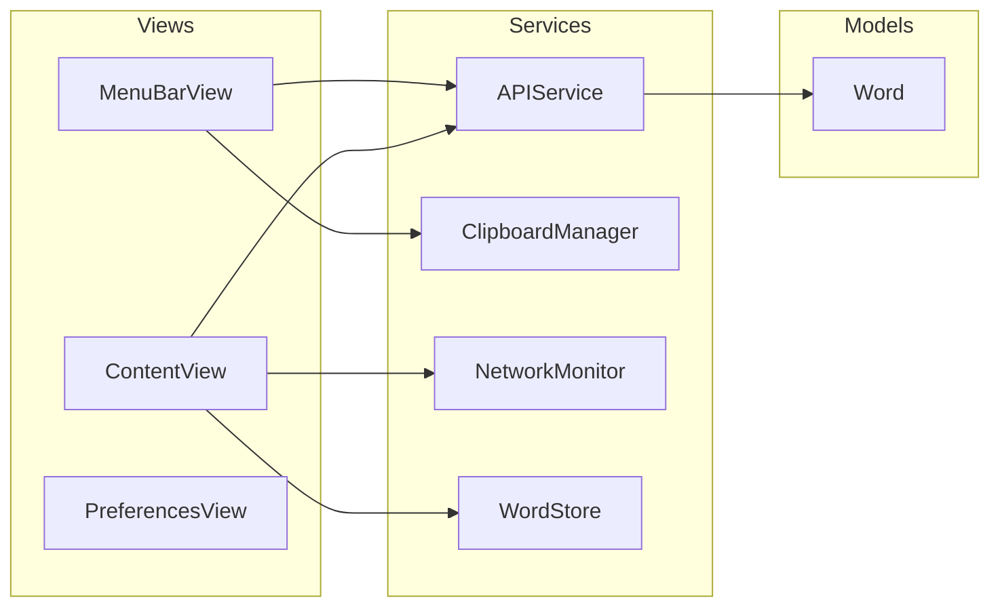
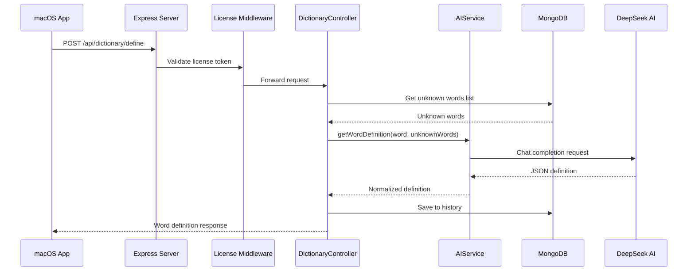
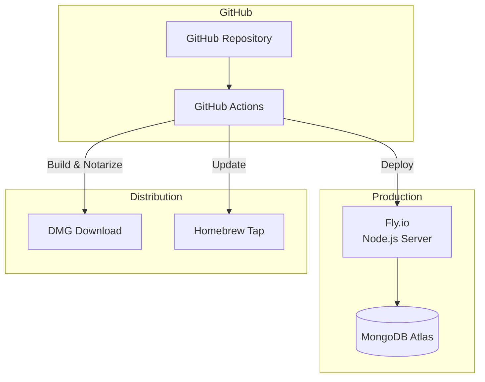

# AI English Dictionary - Architecture

## System Overview



## Component Details

### macOS Application (mac-app/)



**Key Components:**
- `ContentView`: Main dictionary interface
- `MenuBarView`: Menu bar popover UI
- `APIService`: HTTP client for backend communication
- `WordStore`: Local word storage and history
- `ClipboardManager`: System clipboard integration
- `NetworkMonitor`: Online/offline status tracking

### Backend Server (server/)

```mermaid
flowchart TB
    subgraph Routes
        DR[/api/dictionary]
        AR[/api/auth]
        SR[/api/sync]
    end
    
    subgraph Middleware
        LM[License Middleware]
        AM[Auth Middleware]
    end
    
    subgraph Controllers
        DC[DictionaryController]
    end
    
    subgraph Services
        AIS[AIService]
        ES[EmailService]
        RV[ReceiptValidator]
    end
    
    subgraph Models
        UW[UnknownWord]
        U[User]
        L[License]
    end
    
    DR --> LM --> DC
    AR --> AM
    SR --> LM
    DC --> AIS
    DC --> UW
    AIS --> |DeepSeek API| EXT[External AI]
```

**Key Components:**
- `AIService`: Interfaces with DeepSeek AI for word definitions
- `DictionaryController`: Handles word lookup, vocabulary, history
- `License Middleware`: Validates app licenses
- `Auth Middleware`: JWT-based user authentication

## Data Flow

### Word Definition Request



## Database Schema

### UnknownWord Collection
```javascript
{
  word: String,           // The word being defined
  unknownWords: [String], // Words user doesn't know
  createdAt: Date,
  updatedAt: Date
}
```

### User Collection
```javascript
{
  email: String,
  password: String,       // bcrypt hashed
  favorites: [{
    term: String,
    definition: String,
    pronunciation: String,
    partOfSpeech: String,
    exampleSentences: [String]
  }],
  vocabulary: [WordSchema],
  history: [WordSchema],
  isVerified: Boolean,
  verificationToken: String,
  createdAt: Date
}
```

### License Collection
```javascript
{
  licenseKey: String,
  email: String,
  deviceId: String,
  bundleId: String,
  isActive: Boolean,
  createdAt: Date,
  expiresAt: Date
}
```

## API Endpoints

| Endpoint | Method | Auth | Description |
|----------|--------|------|-------------|
| `/api/dictionary/define` | POST | License | Get word definition from AI |
| `/api/dictionary/unknown-words` | GET | License | List all unknown words |
| `/api/dictionary/unknown-words` | POST | License | Add unknown word |
| `/api/dictionary/vocabulary` | GET | License | Get vocabulary list |
| `/api/auth/register` | POST | None | Register new user |
| `/api/auth/login` | POST | None | User login |
| `/api/auth/me` | GET | JWT | Get current user |
| `/api/sync/favorites` | GET/POST | JWT | Sync favorites |
| `/health` | GET | None | Health check |

## Deployment Architecture



## Security Considerations

1. **License Validation**: All dictionary endpoints require valid license token
2. **JWT Authentication**: User endpoints use JWT with 30-day expiry
3. **Password Hashing**: bcrypt with salt rounds
4. **HTTPS Only**: All API communication over TLS
5. **Helmet.js**: Security headers on all responses
6. **CORS**: Configured for allowed origins
7. **Environment Variables**: Secrets stored in `.env` (never committed)

## Monitoring & Observability

### Health Check

The server exposes a health endpoint that returns MongoDB connection status:

```bash
curl https://ai-dic-server.fly.dev/health
# Returns: { "status": "ok", "mongo": "connected", "state": 1 }
```

This endpoint is monitored by the Uptime Check GitHub Action every 30 minutes. If the server becomes unhealthy, an alert issue is automatically created and closed when service is restored.

### Deploy Checklist

Before deploying to production, verify:

1. **Health check** returns `200 OK` with `"mongo": "connected"`
2. **Feature flags** are set correctly for production (`/api/features`)
3. **Metrics** endpoint is accessible (`/api/metrics`)
4. **Firebase credentials** are configured in environment variables
5. **MongoDB Atlas** connection string is valid and TLS is enabled
6. **CORS** origins include all client domains

### Logging

The server uses [Pino](https://github.com/pinojs/pino) for structured logging with automatic sensitive data redaction:

```javascript
const { logger } = require('./lib/logger');
logger.info({ userId: '123' }, 'User action completed');
```

Redacted fields: password, token, authorization, apiKey, secret, creditCard, ssn, email

Log levels: `fatal`, `error`, `warn`, `info`, `debug`, `trace`

### Request Tracing

Every request receives an `X-Request-ID` header. If the client does not provide one, a UUID v4 is generated. This ID is:

- Set as `X-Request-ID` response header
- Available in all downstream log entries for that request
- Useful for correlating logs across services

### Feature Flags

Feature flags are managed via environment variables prefixed with `FEATURE_`:

| Flag | Default | Description |
|------|---------|-------------|
| `FEATURE_NEW_SIGNIN` | `false` | Enable Firebase Apple/Google Sign In |
| `FEATURE_VOCABULARY_SYNC` | `false` | Enable cross-device vocabulary sync |
| `FEATURE_EXPERIMENTAL_API` | `false` | Enable experimental API endpoints |

Flags can be checked at runtime via `GET /api/features`.
